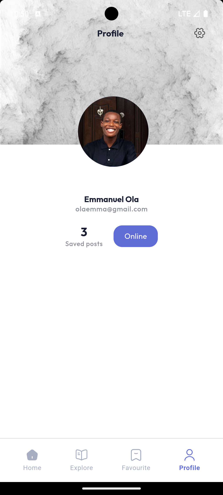

# Paragraf

## About App
A News app which uses NewsAPI to fetch news using retrofit, provider for state management using clean code architecture. It uses Firebase for authencation ans firestore for favourite news storage.   

### Functionalities
- FirebaseAuth for authenticating users
- Fetch news via NewsAPI 
- Query news by different category and custom search using keywords
- Add news as favourite using firestore
- Url launch to read full news on news website
- Url launch to visit news source website
- Share news to others
- Add your image as profile image

### Packages used
- Provider
- Firebase
- image_picker
- get_it
- share_plus
- shared_preference
- Carousel slider
- Retrofit
- Cached network image
- flutter animate

#
##
## Screenshots of App interface

 &nbsp;&nbsp;&nbsp;   &nbsp;&nbsp;&nbsp;  &nbsp;&nbsp;&nbsp;   &nbsp;&nbsp;&nbsp;

 &nbsp;&nbsp;&nbsp;   &nbsp;&nbsp;&nbsp;
 &nbsp;&nbsp;&nbsp;   &nbsp;&nbsp;&nbsp; 

 &nbsp;&nbsp;&nbsp;   &nbsp;&nbsp;&nbsp; 
 &nbsp;&nbsp;&nbsp;   &nbsp;&nbsp;&nbsp;

  &nbsp;&nbsp;&nbsp;   &nbsp;&nbsp;&nbsp;  &nbsp;&nbsp;&nbsp;   &nbsp;&nbsp;&nbsp;  

 &nbsp;&nbsp;&nbsp;   &nbsp;&nbsp;&nbsp;   &nbsp;&nbsp;&nbsp;   &nbsp;&nbsp;&nbsp;  

